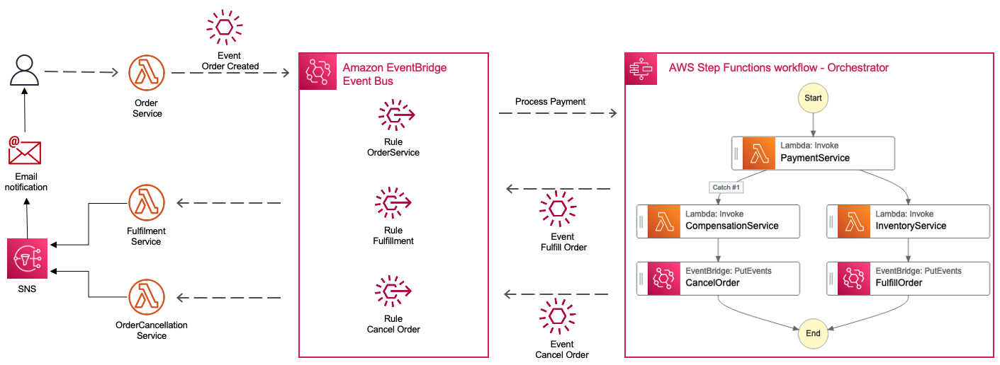

## AWS Serverless Event-Driven Architecture in Java
#### Lambda - EventBridge - StepFunctions

This is a Serverless implementation of the Event-driven architecture style.
AWS services used in this example are: AWS Lambda, Amazon EventBridge, AWS Step Functions and Amazon SNS.
The code is implemented in Java 11 and AWS SDK for Java.



## Description
Event-Driven Microservices(loosely coupled services) form a distributed architecture and each Microservice communicate with each other asynchronously, processing subdomain specific business logic.
Usually, every event-driven architecture contain an event bus(broker) and in many cases there is a need to implement orchestrations for complex business process.
In this example we have used the EventBridge as an event bus and StepFunctions as an orchestrator.

This is fully functional example implemented in Java 11.
The SAM template contains all the information to deploy AWS resources and also the permission required by these service to communicate.
You will be able to create and delete the CloudFormation stack using AWS SAM.
Important: this application uses various AWS services and there are costs associated with these services after the Free Tier usage - please see the AWS Pricing page for details. You are responsible for any AWS costs incurred.

## Framework
The framework used to deploy the infrastructure is SAM - AWS Serverless Application Model

#### Deployment commands
````
mvn clean package

aws s3 mb s3://nlkcno9384iowknoiqwed

aws s3 cp target/sourceCode.zip s3://nlkcno9384iowknoiqwed

sam deploy --s3-bucket nlkcno9384iowknoiqwed --stack-name eda-pattern --capabilities CAPABILITY_IAM
````

#### TESTING
Subscribe to the SNS email and confirm the subscription.
The PaymentService will randomly approve or deny the payment, and you will receive a different email processed by the EventBridge Rule.
Invoke the OrderService from the AWS CLI and wait for the email.

````
aws sns list-topics

aws sns subscribe \
--topic-arn arn:aws:sns:eu-central-1:YOUR_AWS_ACCOUNT:OrdersSNS \
--protocol email \
--notification-endpoint YOUR_EMAIL@DOMAIN.com

aws lambda invoke --function-name OrderService --cli-binary-format raw-in-base64-out --payload '{"orderId": "57a80e2d-d214-4055-aafb-62092cb07cb3","customerId": "2172bbc4-0110-4d8e-8bb9-18830324605e","amount": "11.99"}' response.json

````

#### CLEAN-UP

````
aws cloudformation delete-stack --stack-name eda-pattern

aws s3 rm s3://nlkcno9384iowknoiqwed --recursive

aws s3 rb s3://nlkcno9384iowknoiqwed
````

## Requirements

* [Create an AWS account](https://portal.aws.amazon.com/gp/aws/developer/registration/index.html) if you do not already have one and log in. The IAM user that you use must have sufficient permissions to make necessary AWS service calls and manage AWS resources.
* [AWS CLI](https://docs.aws.amazon.com/cli/latest/userguide/install-cliv2.html) installed and configured
* [AWS Serverless Application Model](https://docs.aws.amazon.com/serverless-application-model/latest/developerguide/serverless-sam-cli-install.html) (AWS SAM) installed

## Author
Razvan Minciuna
https://www.linkedin.com/in/razvanminciuna/
